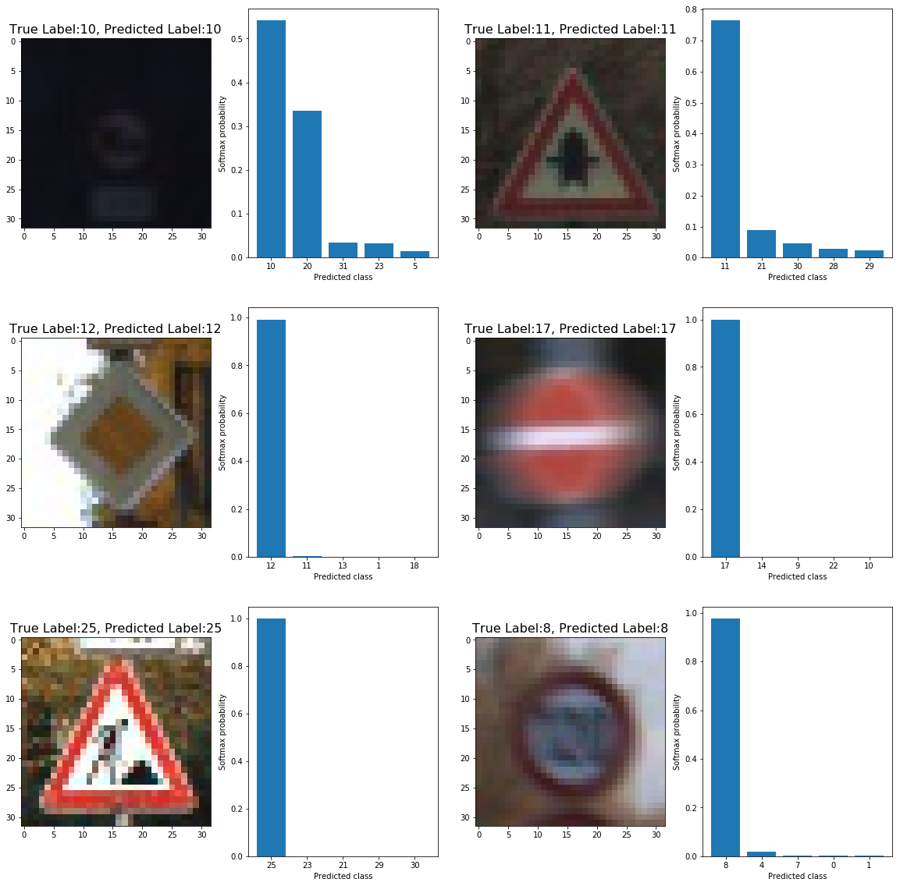

## **Build a Traffic Sign Recognition Project**

### This project is consisted of following processes:
1. **Load and analyze the data set**

The data sets are located in the folder `data`. Training data consists of 34799 examples, validation data 4410 and test data 12630. Input image is a 32x32x3 RGB image. There are 43 different types of traffic signs. The distribution of each set is illustrated as below.


2. **Pre-process the input image**

All the input data is normalized with `(pixel - 128) / 128`. The training data has been rearanged randomly by the function `permutate()`, which can be found in Cell 4 of `Traffic_Sign_Classifier.ipynb`. In addition, Gaussian noise is applied to prevent overfitting during training. The function is `addGaussianNoise()` in Cell 4 of `Traffic_Sign_Classifier.ipynb`. The comparison between original input image and the one with Gaussian noise is shown below.


3. **Design, train and test a model architecture**

The network consists of four convolutional layers followed with max-pooling layers, and fully connected to a 43-dimensional features at the end. The architecture definition is in Cell 5, while training and testing code can be found in Cell 6 through 8. I used Adam optimizer; the learning starts with the value of 0.001 and decays with a rate of 0.5 every 10 epochs. The network description is listed as below.

| Layer         		|     Description	        					| 
|:---------------------:|:---------------------------------------------:| 
| Input         		| 32x32x3 RGB image   							| 
| Convolution 5x5     	| 1x1 stride, same padding, outputs 32x32x6 	|
| RELU					|												|
| Max pooling	      	| 2x2 stride,  outputs 16x16x6 				    |
| Convolution 3x3	    | 1x1 stride, same padding, outputs 16x16x12    |
| RELU					|												|
| Max pooling	      	| 2x2 stride,  outputs 8x8x12 				    |
| Convolution 3x3	    | 1x1 stride, same padding, outputs 8x8x24      |
| RELU					|												|
| Max pooling	      	| 2x2 stride,  outputs 4x4x24 				    |
| Convolution 3x3	    | 1x1 stride, same padding, outputs 4x4x32      |
| RELU					|												|
| Max pooling	      	| 2x2 stride,  outputs 2x2x32 				    |
| Fully connected		|outputs 43 classes                             |

My final model results were:
* training set loss of 3.3e-3, accuracy of 99.986%
* validation set loss of 1.33, accuracy of 85.04% 
* test set loss of 1.19, accuracy of 86.34%

4. **Test the model on New Images**

The model was tested with 6 new images from the internet. The result is shown below.



The predicted accuracy for the 6 new images is 100%. And the top 5 predictions for each image is:
```
Image0: [ 0,  1,  8,  4,  7]
Image1: [15, 26, 29,  4, 14]
Image2: [26, 12,  1, 32, 22]
Image3: [35, 34, 36, 33, 38]
Image4: [38, 18, 40, 36, 34]
Image5: [41, 42, 11, 32,  9]
```

