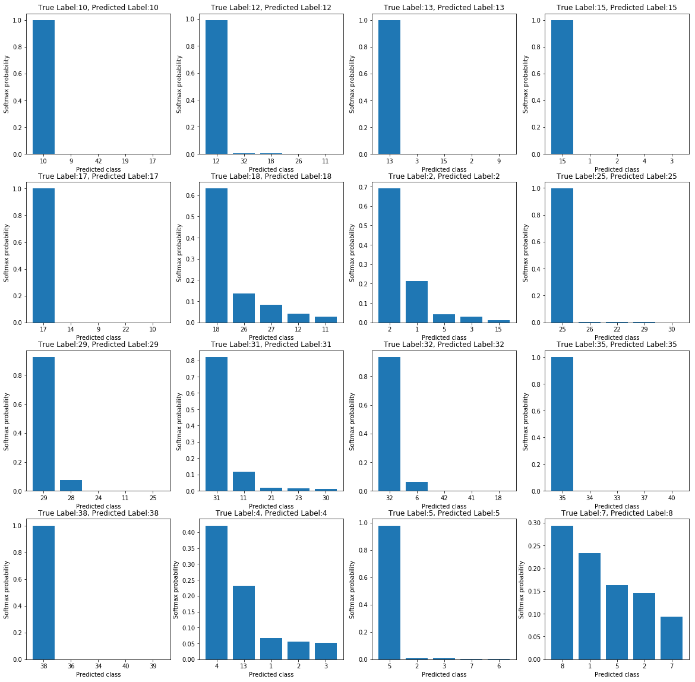

## **Build a Traffic Sign Recognition Project**

### This project is consisted of following processes:
1. **Load and analyze the data set**

The data sets are located in the folder `data`. Training data consists of 34799 examples, validation data 4410 and test data 12630. Input image is a 32x32x3 RGB image. There are 43 different types of traffic signs. The distribution of each set is illustrated as below.

2. **Pre-process the input image**

All the input data is normalized with `(pixel - 128) / 128`. The training data has been rearanged randomly by the function `permutate()`, which can be found in Cell 4 of `Traffic_Sign_Classifier.ipynb`. In addition, Gaussian noise is applied to prevent overfitting during training. The function is `addGaussianNoise()` in Cell 4 of `Traffic_Sign_Classifier.ipynb`. The comparison between original input image and the one with Gaussian noise is shown below.

3. **Design, train and test a model architecture**

The network consists of 5 convolutional layers followed with max-pooling layers, and fully connected to a 43-dimensional features at the end. The architecture definition is in Cell 5, while training and testing code can be found in Cell 6 through 8. The network description is listed as below.

| Layer         		|     Description	        					| 
|:---------------------:|:---------------------------------------------:| 
| Input         		| 32x32x3 RGB image   							| 
| Convolution 5x5     	| 1x1 stride, same padding, outputs 32x32x6 	|
| RELU					|												|
| Max pooling	      	| 2x2 stride,  outputs 16x16x6 				    |
| Dropout	      	    | keep_prob=0.8 			                    |
| Convolution 3x3	    | 1x1 stride, same padding, outputs 16x16x12    |
| RELU					|												|
| Max pooling	      	| 2x2 stride,  outputs 8x8x12 				    |
| Dropout	      	    | keep_prob=0.8 			                    |
| Convolution 3x3	    | 1x1 stride, same padding, outputs 8x8x24      |
| RELU					|												|
| Max pooling	      	| 2x2 stride,  outputs 4x4x24 				    |
| Dropout	      	    | keep_prob=0.8 			                    |
| Convolution 3x3	    | 1x1 stride, same padding, outputs 4x4x32      |
| RELU					|												|
| Max pooling	      	| 2x2 stride,  outputs 2x2x32 				    |
| Dropout	      	    | keep_prob=0.8 			                    |
| Convolution 3x3	    | 1x1 stride, same padding, outputs 2x2x64      |
| RELU					|												|
| Max pooling	      	| 2x2 stride,  outputs 1x1x64 				    |
| Dropout	      	    | keep_prob=0.8 			                    |
| Fully connected		|outputs 43 classes                             |

I used Adam optimizer to train the network from scratch; the model was trained 200 epochs; the learning rate starts with the value of 0.001 and decays with a rate of 0.5 every 20 epochs; the batch size is 128; the learning curves of accuracy and loss are illustrated as below(blue: validating curve; red:training curve).

My final model results were:
* training set loss of 0.1, accuracy of 97.7%
* validation set loss of 0.43, accuracy of 89.34% 
* test set loss of 0.32, accuracy of 90.56%

4. **Test the model on New Images**

The model was tested with 16 new images from the internet. The result is shown below.

The predicted accuracy for 16 new images is 93.75%. It only falsely predicts a sign with true label 7(speed limit 100km/h) to be 8(speed limit 120km/h). As for other signs(some of them have a low brightness and some even jitters), the model have made the right prediction.

The top 5 predictions and corresponding softmax probabilities are:

As we can see from above figure, for the sign with true label 7, the softmax probabilities of top 5 predictions are `[0.29, 0.23, 0.16, 0.15, 0.09]`. The false prediction might be caused by the low brightness and multiple signs in one image(half of another sign appears under the sign).

### Possible improvements
* More signs with different resolutions and sizes could be helpful to the train.
* State-of-art neural networks like vgg/resnet could be introduced to gain better accuracy.