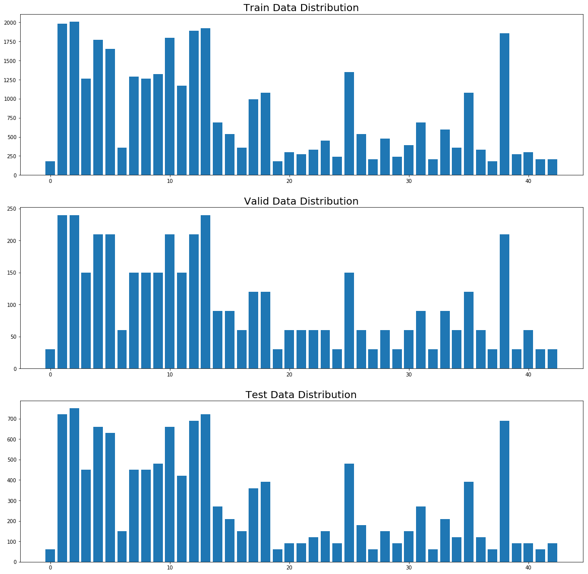
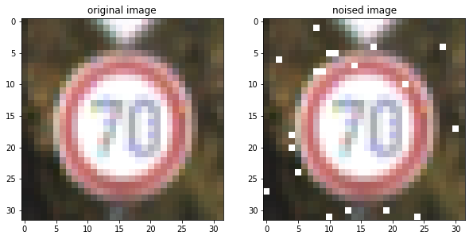
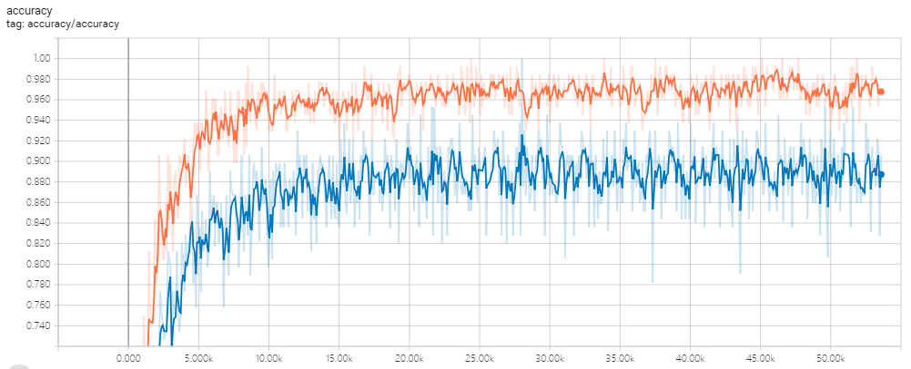
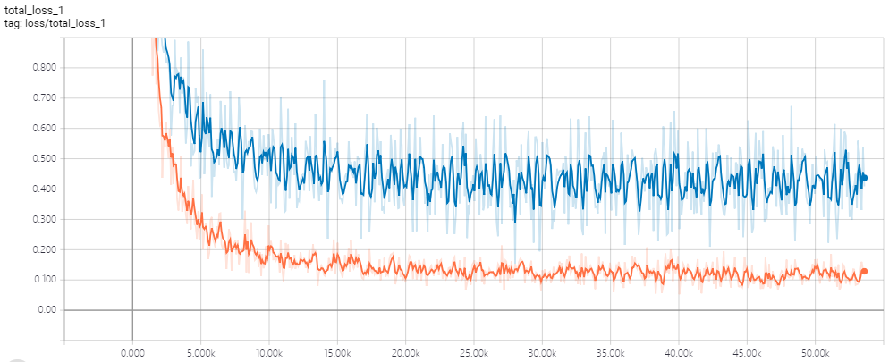
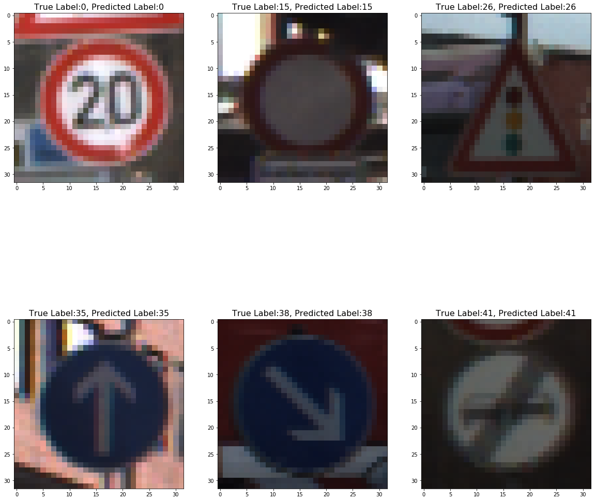

# **Build a Traffic Sign Recognition Project**

## This project is consisted of following processes:
### 1. Load and analyze the data set

The data sets are located in the folder `data`. Training data consists of 34799 examples, validation data 4410 and test data 12630. Input image is a 32x32x3 RGB image. There are 43 different types of traffic signs. The distribution of each set is illustrated as below.

### 2. Pre-process the input image

All the input data is normalized with `(pixel - 128) / 128`. The training data has been rearanged randomly by the function `permutate()`, which can be found in Cell 4 of `Traffic_Sign_Classifier.ipynb`. In addition, Gaussian noise is applied to prevent overfitting during training. The function is `addGaussianNoise()` in Cell 4 of `Traffic_Sign_Classifier.ipynb`. The comparison between original input image and the one with Gaussian noise is shown below.

### 3. Design, train and test a model architecture

The network consists of 5 convolutional layers followed with max-pooling layers, and fully connected to a 43-dimensional features at the end. The architecture definition is in Cell 5, while training and testing code can be found in Cell 6 through 8. The network description is listed as below.

| Layer         		|     Description	        					| 
|:---------------------:|:---------------------------------------------:| 
| Input         		| 32x32x3 RGB image   							| 
| Convolution 5x5     	| 1x1 stride, same padding, outputs 32x32x6 	|
| RELU					|												|
| Max pooling	      	| 2x2 stride,  outputs 16x16x6 				    |
| Dropout	      	    | keep_prob=0.8 			                    |
| Convolution 3x3	    | 1x1 stride, same padding, outputs 16x16x12    |
| RELU					|												|
| Max pooling	      	| 2x2 stride,  outputs 8x8x12 				    |
| Dropout	      	    | keep_prob=0.8 			                    |
| Convolution 3x3	    | 1x1 stride, same padding, outputs 8x8x24      |
| RELU					|												|
| Max pooling	      	| 2x2 stride,  outputs 4x4x24 				    |
| Dropout	      	    | keep_prob=0.8 			                    |
| Convolution 3x3	    | 1x1 stride, same padding, outputs 4x4x32      |
| RELU					|												|
| Max pooling	      	| 2x2 stride,  outputs 2x2x32 				    |
| Dropout	      	    | keep_prob=0.8 			                    |
| Convolution 3x3	    | 1x1 stride, same padding, outputs 2x2x64      |
| RELU					|												|
| Max pooling	      	| 2x2 stride,  outputs 1x1x64 				    |
| Dropout	      	    | keep_prob=0.8 			                    |
| Fully connected		|outputs 43 classes                             |

**Process of finding a solution**

The model was chosen between two different models of different convolutional layers. I chose the one with 5 convolutional layers for the reason that it has lower loss and higher accuracy. It was a new model because I don't possess a previous trained model suitable for the dataset.

Adam optimizer was chosen because it faster convergence and reduced oscillation. Learning rate was tuned between 0.01 to 1e-4. with the learning rate of 0.01, the loss curve even rises up when the training starts; while with the rate of 1e-4, the loss curve descents too slowly. Thus, the learning rate of 0.001 was chosen. The model was trained 200 epochs, which is enough for the dataset; and the learning rate decays with a rate of 0.5 every 20 epochs. The training batch size is 128. In summary, the settings used were:

* batch size: 128
* epochs: 200
* decay epochs: 20
* learning rate: 0.001
* dropout keep probability 0.8

The model performance was measured with the loss and accuracy, and the curves are illustrated as below(blue: validating curve; red: training curve).

|

My final model results were:
* training set loss of 0.1, accuracy of 97.7%
* validation set loss of 0.43, accuracy of 89.34% 
* test set loss of 0.32, accuracy of 90.56%

### 4. Test the model on New Images

The model was tested with 6 new images from the internet. The predicted accuracy for 6 new images is 100%. The description of images are listed as follows.

**Images Description**
Most of the new images are of good quality. The brightness and contrast is Some of them have a low  brightness and some even jitters), the model have made the right prediction.

| Index  | True/Predicted | Brightness | Contrast |Easy/Difficult | Other  |
|:------:|:--------------:|:----------:|:--------:|:----------:|:------:|
|0       |10/10           | low        | low      | difficult  |        |
|1       |11/11           | medium     | medium   | easy       |        |
|2       |12/12           | high       | high     | easy       |        |
|3       |17/17           | high       | low      | difficult  | jitters|
|4       |25/25           | high       | high     | easy       |        |
|5       |8/8             | high       | low      | difficult  | jitters|

The prediction results and the top 5 predictions are shown below. We can see that for the predicted class, most of the probabilities are higher than 0.8, showing the confidence of the model. However, for Image_0, as the image is of low brightness and contrast, it makes the top predicted probability lower than 0.6.

## Possible improvements
* More signs with different resolutions and sizes could be helpful to the train.
* State-of-art neural networks like lenet/vgg/resnet could be introduced to gain better accuracy.